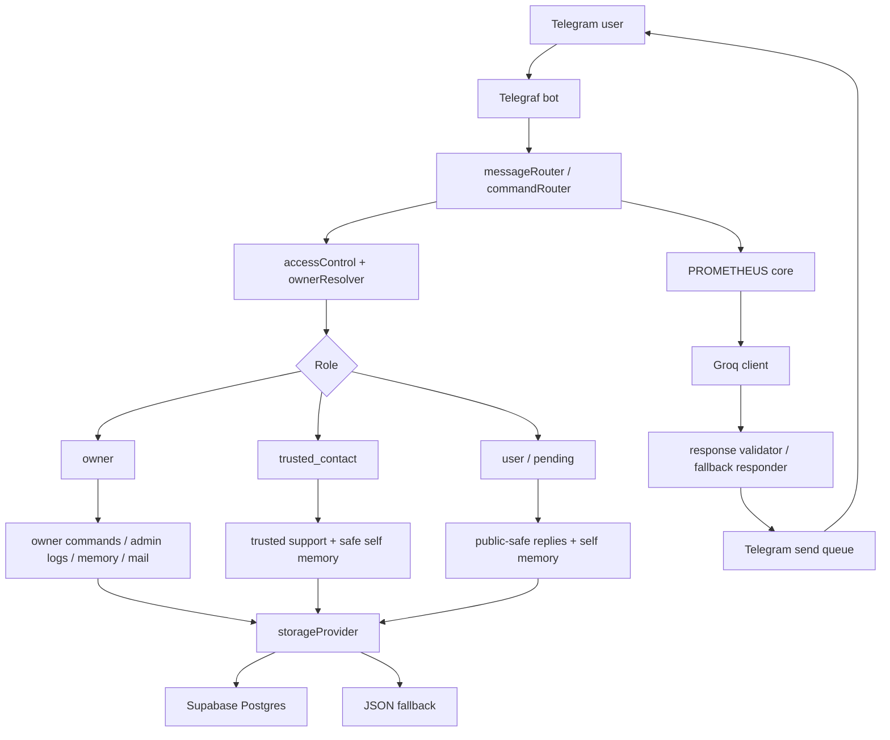

# PROMETHEUS Telegram Bot

PROMETHEUS is the Telegram assistant layer for AegisDesk. It handles owner-scoped memory, trusted-contact support, safe natural replies, Gmail draft assistance, and operational admin commands through `@AegisDesk_PrometheusBot`.

This bot is intentionally scoped. It only stores and reasons over conversations that happen inside the bot. It does not read private Telegram chats, scrape other apps, or control the laptop/device pipeline.

## Current Status

| Area | Status |
| --- | --- |
| Telegram command routing | Implemented |
| Numeric Telegram ID access control | Implemented |
| Owner memory and trusted-contact memory boundaries | Implemented |
| Supabase storage provider and migrations | Implemented |
| JSON storage fallback | Available |
| Groq natural replies with safe fallback | Implemented |
| Trusted-contact support alerts | Implemented |
| Telegram send queue and rate limiting | Implemented |
| Gmail draft skill | Implemented for owner-only draft/send workflows |
| Render deployment config | Present |
| Test coverage | Vitest suite covers commands, access, memory, support, Groq fallback/rate limits, Gmail draft behavior, and HTTP health |

Latest local expectation: `npm test` should run the Vitest suite, and `npm run build` should compile to `dist/src/index.js`.

## Workflow



### Runtime Steps

1. Telegram sends an update to the bot.
2. `src/telegram/messageRouter.ts` and `src/telegram/commandRouter.ts` classify normal messages and commands.
3. `src/security/accessControl.ts` and `src/auth/ownerResolver.ts` resolve the sender role by numeric Telegram ID.
4. Restricted commands are checked server-side even if they are hidden from the Telegram menu.
5. The storage provider loads only the memory allowed for that role.
6. PROMETHEUS core plans the reply, optionally calls Groq, validates the response, and falls back safely when needed.
7. Replies are sent through the Telegram send queue with rate limiting.
8. Safe summaries, audit events, support events, and memory records are persisted according to scope.

## Memory Model

PROMETHEUS memory is deliberately filtered before use.

| Memory Scope | Who Can See It | Notes |
| --- | --- | --- |
| `owner_only` | Owner only | Private owner context. Never exposed to trusted contacts or public users. |
| `trusted_contacts` | Owner and approved contacts when allowed | Shared only through explicit visibility and contact rules. |
| `self_only` | Same Telegram user only | User-specific bot memory and safe conversation summary. |
| `public` | Everyone | Safe general bot facts and non-private information. |

Memory code lives mainly in:

- `src/memory/`
- `src/storage/memoryRepository.ts`
- `src/storage/conversationSummaryRepository.ts`
- `src/storage/storageProvider.ts`
- `src/storage/supabaseClient.ts`
- `supabase/migrations/001_prometheus_memory.sql`

Important memory rules:

- Use `OWNER_TELEGRAM_ID`; never trust username, display name, or text claims.
- Do not print `.env` values or service-role keys.
- Redact secret-like message content before persistence.
- Keep owner memory out of trusted-contact and public prompts.
- Keep the bot scope explicit: only bot conversations are logged.
- Supabase schema must be applied before running memory migration.

## Trusted Contact Support

Trusted contacts are approved by the owner through numeric Telegram ID.

Current trusted-contact slots:

```text
aksharaa
vathanya
maddhurika
```

Support flow:

1. A trusted contact talks to PROMETHEUS inside the bot.
2. `src/support/emotionalStateDetector.ts` classifies support severity.
3. `src/support/trustedSupportService.ts` decides whether to create support memory, owner alerts, or safe fallback responses.
4. Medium alerts use cooldowns; high/critical alerts are more immediate and deduplicated.
5. Owner alerts remain short, safe, and explicitly bot-scoped.

PROMETHEUS should use gentle, natural support language. It must not claim human emotions, overstate urgency, or pressure the user to message Eswar repeatedly.

## Main Commands

Full command details are in `BOT_COMMANDS.md`.

Common commands:

```text
/start
/help
/about
/ping
/privacy
/whoami
/style
/learnmode
/forgetme
```

Owner commands include:

```text
/memory
/contacts
/trust <telegram_user_id> <contact_id>
/untrust <contact_id>
/tell <contact_id> <message>
/admin
/support
/mail
/notify
```

Trusted contacts can use safe public commands and support-related flows, but cannot access owner memory, admin logs, raw memory JSON, system prompts, or private conversations.

## Storage

Set the storage mode with:

```env
DATABASE_PROVIDER=json
DATABASE_PROVIDER=supabase
```

Supabase mode requires:

```env
SUPABASE_URL=
SUPABASE_SERVICE_ROLE_KEY=
```

Apply the schema before importing existing memory:

```bash
npm run build
npm run migrate:memory
```

The SQL migration is:

```text
supabase/migrations/001_prometheus_memory.sql
```

## Environment

Use `.env.example` as the safe template. Do not commit real secrets.

Required or commonly used variables:

```env
TELEGRAM_BOT_TOKEN=
OWNER_TELEGRAM_ID=
GROQ_API_KEY=
GROQ_MODEL=
GROQ_MODEL_PRIMARY=
GROQ_MODEL_FALLBACK=
DATABASE_PROVIDER=
SUPABASE_URL=
SUPABASE_SERVICE_ROLE_KEY=
BOT_PUBLIC_URL=
PORT=
```

## Development

Install dependencies:

```bash
npm install
```

Run locally:

```bash
npm run dev
```

Build:

```bash
npm run build
```

Start compiled output:

```bash
npm run start
```

The compiled entry point is:

```text
dist/src/index.js
```

This matters for Render and other Node hosts.

## Testing

Run the full test suite:

```bash
npm test
```

Test areas include:

- access control
- owner identity
- command routing
- command menus
- persistent memory
- Supabase storage behavior
- trusted contacts
- trusted support
- Groq fallback and rate limits
- Telegram send queue
- Gmail draft skill
- HTTP health endpoints

## Deployment Notes

Render config is in:

```text
render.yaml
```

Operational checks:

- `GET /health` is the lightweight health endpoint.
- `GET /health/groq` performs a small Groq check and should not be used as a keep-awake ping.
- Use `node dist/src/index.js` after build.

## Progress Log

Completed:

- Core Telegram bot routing and command menu.
- Owner/trusted/public role separation.
- Numeric owner identity enforcement.
- Supabase-backed memory repositories.
- Safe JSON fallback storage.
- Trusted contact approval and revocation.
- Trusted support event and alert flow.
- Groq error classification and fallback responses.
- Telegram inbound and outbound rate limiting.
- Gmail draft skill with owner-only confirmation-oriented workflows.
- Privacy-safe bot-log commands and admin audit checks.

Guardrails to preserve:

- Owner data stays owner-only unless explicitly shared.
- Trusted contacts never receive owner-only memory.
- Non-owner restricted responses should not reveal private logs exist.
- Groq is reply assistance, not authorization.
- The bot is not the AegisDesk device-control channel.
- Tests or dry runs are not production verification unless they actually exercise the relevant service.

## Related Docs

- `BOT_COMMANDS.md`
- `ROLE_CAPABILITIES.md`
- `TELEBOT_DOCUMENTATION.md`
- `docs/GMAIL_DRAFT_SKILL.md`
- `supabase/migrations/001_prometheus_memory.sql`
