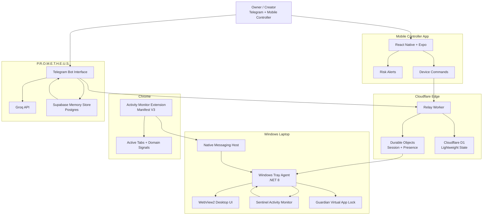

<div align="center">


<br />


<br />


</div>

## Overview

**AegisDesk** is a secure personal agent ecosystem for remote laptop control, activity monitoring, trusted-contact support, and owner-scoped automation.

It connects a Windows laptop, mobile controller, browser activity monitor, Cloudflare relay, Supabase memory layer, and the **P.R.O.M.E.T.H.E.U.S.** Telegram interface into one controlled system. The goal is simple: give the owner fast, trusted control over their machine without pretending to be a spyware suite, shell executor, or unrestricted remote-access tool.

AegisDesk is built around confirmation, scope, and restraint.

## Why AegisDesk

Modern personal systems are scattered: laptop controls live in one place, mobile alerts in another, browser activity somewhere else, and personal automation usually leaks too much context.

AegisDesk brings those pieces together under a secure owner-first model:

| Need | AegisDesk Answer |
|---|---|
| Remote control | Pair a trusted mobile app with the laptop agent |
| Activity awareness | Track active apps and browser tab metadata |
| Risk detection | Flag risky apps, domains, or usage patterns |
| Fast response | Send lock, sleep, restart, shutdown, and app-lock commands |
| Trusted support | Let approved contacts interact with PROMETHEUS safely |
| Memory | Store owner-scoped bot memory in Supabase |
| Boundaries | No arbitrary shell execution, no private chat spying |

## Feature Highlights

- Pair laptop with a trusted mobile controller
- Send lock, sleep, hibernate, logout, restart, and shutdown commands
- Monitor current apps and browser tab activity
- Detect risky apps and domains
- Send mobile risk alerts
- Restrict or lock selected apps and browser tabs
- Show virtual app lock overlays
- Use owner-scoped Telegram bot memory
- Support trusted-contact mode without exposing owner memory
- Persist memory in Supabase Postgres
- Use terminal-inspired desktop and mobile UI
- Integrate Chrome Extension Manifest V3 with Native Messaging

## System Architecture



## Repository Structure

```txt
AegisDesk-PROMETHEUS-Agent/
├─ apps/
│  ├─ windows-agent/              # .NET 8 tray agent and desktop control layer
│  └─ mobile/                     # React Native / Expo controller app
├─ services/
│  └─ relay-worker/               # Cloudflare Worker relay and Durable Object logic
├─ extension/
│  └─ chrome-activity-monitor/    # Chrome MV3 activity monitor
├─ native-host/
│  └─ windows/                    # Chrome Native Messaging host bridge
├─ telebot/
│  ├─ src/                        # PROMETHEUS Telegram bot source
│  ├─ supabase/                   # Postgres migrations and memory schema
│  └─ tests/                      # Bot, memory, auth, and safety tests
├─ scripts/                       # Build and utility scripts
└─ README.md
```

## Tech Stack

| Layer | Technologies |
|---|---|
| Windows Agent | C# .NET 8, Windows Tray Agent, WebView2 |
| Mobile App | React Native, Expo, TypeScript |
| Relay | Cloudflare Workers, Durable Objects, Cloudflare D1 |
| Browser Monitor | Chrome Extension Manifest V3 |
| Local Browser Bridge | Native Messaging |
| Bot Interface | Telegram Bot API, Groq API |
| Memory Store | Supabase Postgres |
| Hosting | Render, Cloudflare |

## Setup

Clone the repository:

```bash
git clone https://github.com/eswarb-dev/AegisDesk-PROMETHEUS-Agent.git
cd AegisDesk-PROMETHEUS-Agent
```

Install dependencies for the TypeScript workspaces:

```bash
npm install
```

Configure environment files for the services you plan to run. Required secrets vary by component, but commonly include:

```env
TELEGRAM_BOT_TOKEN=
OWNER_TELEGRAM_ID=
GROQ_API_KEY=
SUPABASE_URL=
SUPABASE_SERVICE_ROLE_KEY=
```

## Windows Agent

The Windows Agent is the local control surface for AegisDesk. It runs as a tray agent, receives confirmed commands from the relay, reports current activity, and coordinates Sentinel and Guardian behavior.

| Capability | Description |
|---|---|
| Device actions | Lock, sleep, hibernate, logout, restart, shutdown |
| Activity state | Current foreground app and system status |
| Local UI | WebView2 terminal-inspired desktop interface |
| App lock | Guardian overlay for restricted apps |
| Browser bridge | Receives Native Messaging events from Chrome |

Build:

```bash
dotnet build
```

## Mobile App

The mobile controller pairs with the laptop and sends trusted commands through the Cloudflare relay.

Core flows:

- Pair a laptop
- View device status
- Receive risk alerts
- Send confirmed control commands
- Review app/domain activity signals
- Trigger lock or restriction actions

Run:

```bash
npm run mobile
```

## Relay Worker

The relay worker connects trusted controllers to the Windows Agent without exposing the laptop directly.

It uses:

- Cloudflare Workers for edge routing
- Durable Objects for session coordination
- Cloudflare D1 for lightweight persistent state

Deploy:

```bash
npx wrangler deploy
```

## Chrome Extension

The Chrome activity monitor observes browser tab metadata and forwards safe activity signals to the local Native Messaging Host.

It is designed for activity awareness, not private content capture.

| Signal | Purpose |
|---|---|
| Active domain | Risk classification |
| Tab title | Contextual activity summary |
| Window focus | Current usage state |
| Restricted domain match | Alert or lock trigger |

## Telegram Bot

The PROMETHEUS Telegram bot is the owner-facing assistant layer.

It supports:

- Owner-scoped memory
- Trusted-contact support mode
- Supabase persistent storage
- Groq-powered natural replies
- Safe fallback responses
- Owner identity verification by Telegram numeric ID
- Rate-limited Telegram sends
- No owner memory exposure to non-owner users

Run inside `telebot/`:

```bash
npm install
npm run build
npm run start
```

Run tests:

```bash
npm test
```

## Security Model

AegisDesk is intentionally bounded.

| Boundary | Guarantee |
|---|---|
| No arbitrary shell execution | The system does not expose free-form shell command execution |
| No private Telegram spying | PROMETHEUS stores only conversations that happen inside the bot |
| Owner memory is owner-scoped | Non-owner users cannot access owner memory |
| Telegram identity is numeric-ID based | Username, display name, and text claims are never trusted for ownership |
| Device action confirmation | A command is not claimed as complete unless the backend confirms it |
| Trusted contacts are limited | Support contacts receive only approved and filtered context |
| Browser monitoring is scoped | Activity signals are used for safety and control, not private message capture |

## Roadmap

- Harden end-to-end pairing flow
- Add signed command envelopes
- Add richer device status timeline
- Improve mobile risk notification controls
- Expand Guardian app lock policies
- Add relay observability dashboard
- Add encrypted memory fields for sensitive bot context
- Add recovery mode for lost controller pairing
- Add multi-device owner console

## License

This project is currently maintained as a personal secure-agent ecosystem.

License details will be added before public release.
